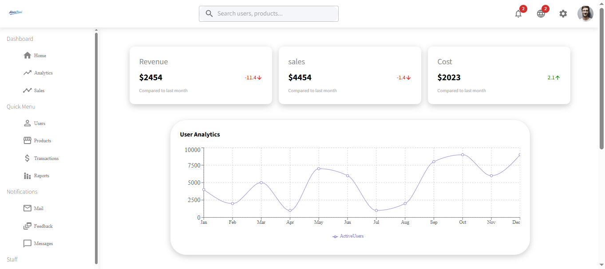
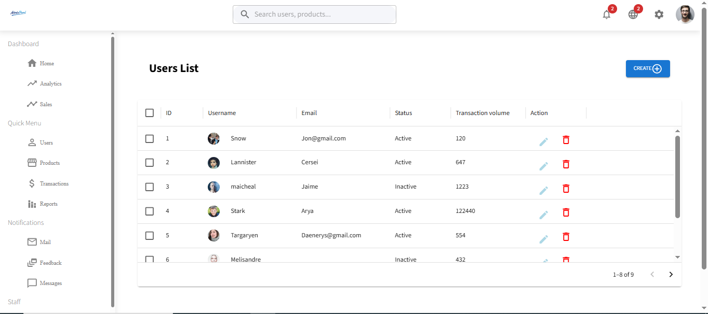
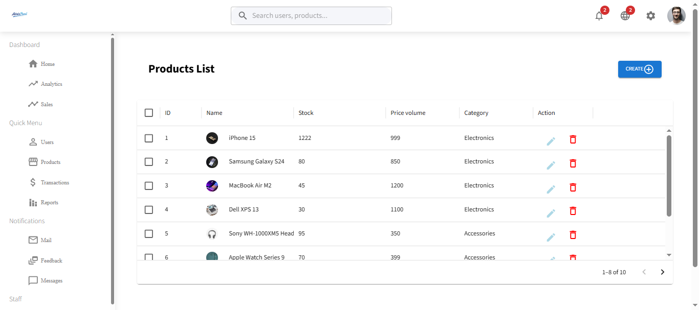

# 📊 React Admin Dashboard (E-commerce Management Panel)

A modern, responsive admin dashboard built with **React**, **TypeScript**, and **Material UI**. This dashboard provides a comprehensive management interface with real-time analytics, user management, product administration, and interactive charts.


---

## 🌐 Live Demo

**[View Live Demo](https://teal-youtiao-a3ab73.netlify.app/)** 

---

## ✨ Features

- 📈 **Interactive Analytics Dashboard** - Real-time charts and statistics using Recharts
- 👥 **User Management** - Create, view, and manage user profiles with detailed information
- 🛍️ **Product Management** - Complete CRUD operations for product inventory
- 📱 **Fully Responsive Design** - Seamlessly adapts to mobile, tablet, and desktop screens
- 🎨 **Modern UI Components** - Built with Material UI for a professional look and feel
- 📊 **Data Visualization** - Beautiful and interactive charts for analytics
- 🔍 **Advanced Search with Debounce** - Optimized search functionality for users and products with debounced input
- 🔍 **Transaction Tracking** - View and manage transactions with table and card layouts
- ⚡ **Fast Performance** - Built with Vite for optimal development and build performance
- 🎯 **Type-Safe Development** - Full TypeScript support for better code quality
- 📡 **API Integration** - Axios for efficient data fetching and server communication
- 🎪 **Smart Layout** - Dynamic content display with sidebar navigation and responsive topbar

---

## 🛠️ Tech Stack

### Frontend Framework
- **React** 18+ - UI library for building user interfaces
- **TypeScript** - Type-safe JavaScript for better development experience
- **Vite** - Lightning-fast build tool and dev server

### UI & Styling
- **Material UI (MUI)** - Enterprise-grade component library
- **CSS3** - Custom styling and responsive design

### Data Visualization & Charts
- **Recharts** - Composable charting library built on React components

### HTTP Client
- **Axios** - Promise-based HTTP client for API requests

### Development Tools
- **ESLint** - Code quality and consistency checker
- **npm** - Package manager

---

## 📸 Screenshots

### Dashboard Overview

*Main dashboard with analytics cards and charts*

### User Management

*User list with management capabilities*

### Product Management

*Product inventory and management interface*


---

## 🚀 Installation & Setup

### Prerequisites
- **Node.js** (v16 or higher)
- **npm** (v8 or higher) or **yarn**

### Steps

1. **Clone the repository**
   ```bash
   git clone https://github.com/yourusername/react-admin-dashboard.git
   cd react-admin-dashboard/Admin\ Panel
   ```

2. **Install dependencies**
   ```bash
   npm install
   ```

3. **Start the development server**
   ```bash
   npm run dev
   ```
   The application will be available at `http://localhost:5173`

4. **Build for production**
   ```bash
   npm run build
   ```

5. **Preview the production build**
   ```bash
   npm run preview
   ```

---

## 📁 Project Structure

```
Admin Panel/
│
├── src/
│   ├── components/
│   │   ├── topBar.tsx              # Navigation header component
│   │   ├── sideBar.tsx             # Sidebar navigation menu
│   │   ├── featuredInfo.tsx        # Featured statistics cards (Revenue, Sales, Cost)
│   │   ├── charts.tsx              # Analytics charts component
│   │   ├── largWidget.tsx          # Large transaction widget
│   │   ├── smallWidget.tsx         # Small statistics widget
│   │   ├── productDetailsWidget.tsx # Product details display
│   │   ├── productEditWidget.tsx   # Product editing form
│   │   ├── userdetailsCard.tsx     # User profile card
│   │   ├── userEditDetailsCard.tsx # User edit form
│   │   ├── snackBar.tsx            # Notification/toast component
│   │
│   ├── Pages/
│   │   ├── Home.tsx                # Main dashboard page
│   │   ├── UserList.tsx            # Users management page
│   │   ├── UserDetails.tsx         # Individual user details page
│   │   ├── CreateUser.tsx          # Create new user page
│   │   ├── ProductList.tsx         # Products management page
│   │   ├── ProductDetails.tsx      # Individual product details page
│   │   ├── CreateProduct.tsx       # Create new product page
│   │
│   ├── App.tsx                     # Root component
│   ├── App.css                     # Global styles
│   ├── main.jsx                    # Application entry point
│   ├── vite-env.d.ts              # Vite environment types
│
├── public/
│   └── fonts/                      # Custom fonts
│
├── db.json                         # Mock database (JSON Server)
├── package.json                    # Project dependencies
├── tsconfig.json                   # TypeScript configuration
├── vite.config.js                  # Vite configuration
├── eslint.config.js               # ESLint configuration
├── index.html                      # HTML entry point
└── README.md                       # Project documentation
```

### Folder Descriptions

- **components/** - Reusable UI components used across pages
- **Pages/** - Page-level components that represent different routes/views
- **public/** - Static assets like fonts and images
- **db.json** - Mock database file for local API testing with JSON Server

---

## 📋 Available Scripts

| Command | Description |
|---------|-------------|
| `npm run dev` | Start development server |
| `npm run build` | Build for production |
| `npm run preview` | Preview production build |
| `npm run lint` | Run ESLint to check code quality |

---

## 🔧 Configuration Files

### `vite.config.js`
Main Vite configuration file for build and dev server settings.

### `tsconfig.json`
TypeScript compiler options and project settings.

### `eslint.config.js`
ESLint rules for code quality and consistency.

### `db.json`
Mock database for testing API endpoints locally.

---

## 🚀 Future Improvements

- [ ] **Authentication & Authorization** - Add user login/logout with role-based access control
- [ ] **Dark Mode** - Implement theme switching between light and dark modes
- [x] **Advanced Filtering** - Add filters and search functionality to user and product lists
- [ ] **Data Export** - Export user and product data to CSV/Excel formats
- [ ] **Real Database Integration** - Replace JSON Server with a real backend (MongoDB, PostgreSQL, etc.)
- [ ] **Performance Optimization** - Code splitting and lazy loading for faster load times
- [ ] **PWA Support** - Add Progressive Web App capabilities for offline functionality
- [ ] **Testing Suite** - Implement unit and integration tests with Jest and React Testing Library
- [ ] **Email Notifications** - Send notifications for important events
- [ ] **Advanced Analytics** - Add more detailed analytics and reporting features
- [ ] **Multi-language Support** - Implement internationalization (i18n)
- [ ] **API Documentation** - Create comprehensive API documentation

---

## 📝 License

This project is licensed under the **MIT License** - see the [LICENSE](./LICENSE) file for details.

---

## 👨‍💻 Author

**Your Name**
- GitHub: [@sarahelaraby2009](https://github.com/sarahelaraby2009)

- Email: sarahelaraby2009@gmail.com

---

## 🤝 Contributing

Contributions are welcome! Please feel free to submit a Pull Request. For major changes, please open an issue first to discuss what you would like to change.

---

## 📞 Support

If you encounter any issues or have questions, please create an issue on GitHub or contact the author.

---

**Thank you for checking out this project!** If you find it helpful, please give it a ⭐ star on GitHub!
